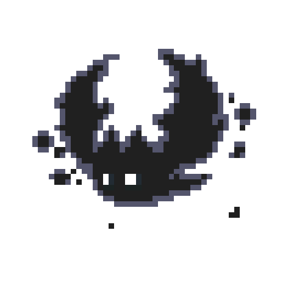

<!-- Banner: Certifique-se de que a imagem está na pasta assets e com o nome exato banner.png ou banner.jpg -->

  

<!-- Redes Sociais no Estilo Minimalista -->

  
  

---

### 🥷 About Me

<table width="100%" style="border: none;">
  <tr>
    <td width="70%" valign="top" style="border: none;">
      
Olá! Sou <strong>Maycon</strong>, estudante de <strong>Ciência da Computação</strong>.

      
Foco no desenvolvimento de uma base sólida em engenharia de software, com ênfase na resolução de problemas lógicos, compreensão de sistemas de baixo nível e arquitetura de aplicações.

      <ul>
        <li>📚 Cursando Ciência da Computação</li>
        <li>🎯 Foco em Algoritmos, Estruturas de Dados e Compiladores</li>
      </ul>
    </td>
    <td width="30%" align="center" valign="middle" style="border: none;">
      
    </td>
  </tr>
</table>

---

### ⚡ Technologies

  
  
  
  
  

---

## 📊 Statistics

  

  

---

### 🐍 Commits

  

